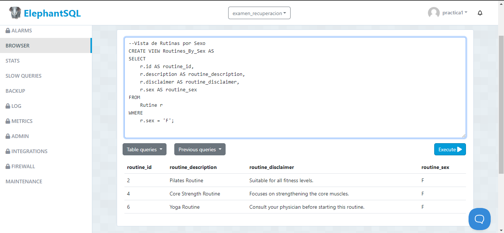
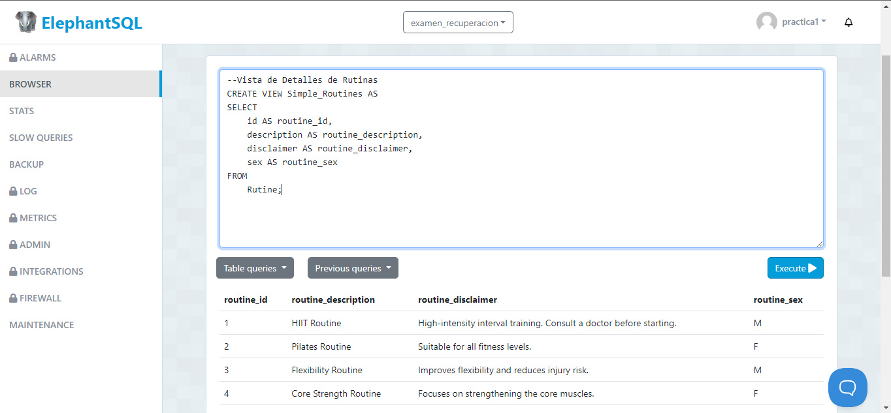

ExamenRecu - Views Projects
1. Routine_By_Sex AS
Sentencia:
--Vista de Rutinas por Sexo
CREATE VIEW Routine_By_Sex AS
SELECT 
    r.id AS routine_id,
    r.description AS routine_description,
    r.disclaimer AS routine_disclaimer,
    r.sex AS routine_sex
FROM 
    Rutine r
WHERE 
    r.sex = 'F'; 

Captura

2. Simple_Routines
Sentencia:
--Vista de Detalles de Rutinas
CREATE VIEW Simple_Routines AS
SELECT 
    id AS routine_id,
    description AS routine_description,
    disclaimer AS routine_disclaimer,
    sex AS routine_sex
FROM 
    Rutine;

Captura

3. Routines_Exercise_Count 
Sentencia:
--Vista de Rutinas con Número de Ejercicios
CREATE VIEW Routines_Exercise_Count AS
SELECT 
    r.id AS routine_id,
    r.description AS routine_description,
    COUNT(re.id) AS exercise_count
FROM 
    Rutine r
JOIN 
    Routine_Exercise re ON r.id = re.routine_id
GROUP BY 
    r.id, r.description;

Captura

